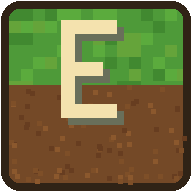

# 🚀 FranyuLauncher

<div align="center">
  
  
  ### *El lanzador definitivo de Minecraft: Java Edition para Android.*
  
  [](https://github.com/fdef54983-del/FRANYULAUNCHERnew/actions)
  [](https://github.com/fdef54983-del/FRANYULAUNCHERnew/releases)
  [-35C96F?style=for-the-badge&logo=android)](https://github.com/fdef54983-del/FRANYULAUNCHERnew)
  [](LICENSE)

  <p align="center">
    <strong>FranyuLauncher</strong> es un lanzador de alto rendimiento para Android que permite ejecutar cualquier versión de <b>Minecraft: Java Edition</b> con fluidez, soporte de modloaders modernos, control total de gráficos y una interfaz intuitiva con estética esmeralda.
  </p>
</div>

---

## 🌟 Características Principales

| Categoría | Capacidades |
| :--- | :--- |
| ⚡ **Rendimiento & Fluidity** | Motor JVM optimizado con recolector **G1GC**, pre-touch de memoria, subprocesos paralelos y control térmico inteligente para reducir tirones y sobrecalentamiento. |
| 🎮 **Modloaders Completos** | Integración nativa con **Fabric**, **Forge**, **NeoForge**, **Quilt**, **OptiFine** y **Better Than Adventure (BTA)**. |
| 📦 **Navegador de Mods** | Descarga e instala mods y modpacks directamente con soporte para las APIs oficiales de **Modrinth** y **CurseForge**. |
| ☕ **Runtimes Multiversión** | Soporte para **Java 8**, **Java 17** y **Java 21** precompilados para arquitecturas `arm64-v8a`, `armeabi-v7a`, `x86` y `x86_64`. |
| 🎨 **Interfaz Renovada** | Diseño móvil moderno con animaciones fluidas, panel hero de instancia activa, historial de partidas y paleta temática *Emerald & Forest*. |
| 🕹️ **Controles Versátiles** | Mapeo táctil en pantalla 100% personalizable (botones virtuales, joysticks, cajones desplegables) y soporte para mandos físicos (Bluetooth/OTG). |
| 🛡️ **Seguridad y Diagnóstico** | Escaneo automático de salud de almacenamiento, detección de incompatibilidad entre mods y protección contra fallos inesperados. |

---

## 📱 Compatibilidad con Android

FranyuLauncher está preparado para funcionar en una amplia gama de dispositivos:
* **Versión mínima soportada:** Android 5.0 (API 21 - Lollipop)
* **Versiones recomendadas:** Android 10, 11, 12, 13, 14 y 15 (API 35/36)
* **Almacenamiento Scoped:** Compatible con directivas Scoped Storage y almacenamiento heredado (`requestLegacyExternalStorage`).
* **Permisos automáticos:** Notificaciones, acceso a archivos de juego, vibración háptica y ejecución continua como servicio de primer plano.

---

## 📥 Descarga e Instalación

Puedes descargar la última versión compilada directamente desde la pestaña de [**Releases**](https://github.com/fdef54983-del/FRANYULAUNCHERnew/releases):

1. **`FranyuLauncher-1.3.apk` (Recomendada)**: 
   * Incluye los entornos Java Runtime (JRE 8, JRE 17 y JRE 21). Instalar y jugar directamente sin configuraciones adicionales.
2. **`FranyuLauncher-1.3-noruntime.apk`**: 
   * Versión ligera para dispositivos con espacio reducido o que gestionan sus propios runtimes Java.
3. **`FranyuLauncher-1.3.aab`**:
   * Paquete Android App Bundle optimizado para distribución.

> Cada versión publicada cuenta con su archivo de comprobación criptográfica `.sha256` para garantizar la integridad y seguridad del instalador.

---

## 🛠️ Compilación desde el Código Fuente

El proyecto utiliza Gradle con compatibilidad multiplataforma.

### Requisitos
* JDK 17 (Eclipse Temurin recomendado)
* Android SDK (API 35/36 y Build-Tools instaladas)

### Comandos de Compilación
```bash
# Compilar APK completo con runtimes
./gradlew :app_pojavlauncher:assembleFullRelease

# Compilar versión ligera (sin runtimes)
./gradlew :app_pojavlauncher:assembleNoruntimeDebug

# Generar App Bundle (AAB)
./gradlew :app_pojavlauncher:bundleFullRelease
```

Los binarios generados se encontrarán en:
* `app_pojavlauncher/build/outputs/apk/full/release/`
* `app_pojavlauncher/build/outputs/apk/noruntime/debug/`
* `app_pojavlauncher/build/outputs/bundle/fullRelease/`

---

## 🔄 Integración Continua (CI/CD)

El repositorio incluye un pipeline automatizado en **GitHub Actions** (`.github/workflows/android.yml`):
* Compila automáticamente cada cambio enviado a las ramas de desarrollo.
* Valida la firma del paquete (`apksigner`) y la alineación de bytes (`zipalign`).
* Calcula las sumas de verificación `sha256sum`.
* Publica los artefactos verificados directamente en los Releases de GitHub.

---

## 📄 Licencia y Créditos

FranyuLauncher es un desarrollo comunitario bajo la licencia **GNU General Public License v3.0 (GPLv3)**.
* Basado en los ecosistemas de código abierto PojavLauncher y MojoLauncher.
* Minecraft es una marca registrada de Mojang AB / Microsoft. FranyuLauncher no está respaldado ni afiliado con Mojang ni Microsoft.
